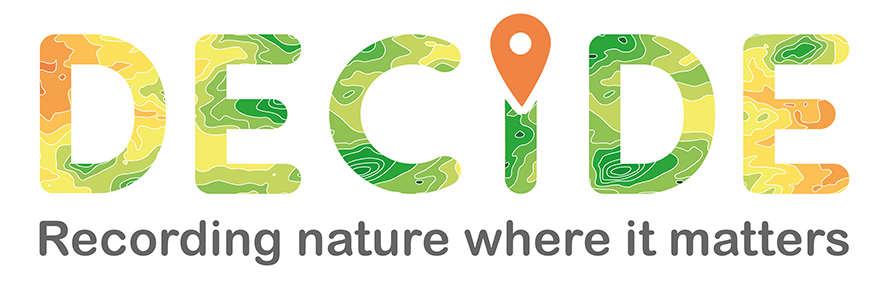

```{r setup, include=FALSE}
knitr::opts_chunk$set(echo = TRUE,error=T)
```

## Hello `r params$name`!

Thank you for signing up to receive the MyDECIDE personalised emails.

### Your details

This is the information you have provided to us:

Your email is `r params$email`

`r if(params$record_online){"You record online."}else{"You don't record online."}`

 `r if(!is.na(params$irecord_username)){paste("Your iRecord username is <code>",params$irecord_username,"</code>.")}`
 
`r if(!is.na(params$ispot_username)){paste("Your iSpot username is <code>",params$ispot_username,"</code>.")}`
  
`r if(!is.na(params$inat_username)){paste("Your iNaturalist username is <code>",params$inat_username,"</code>.")}`

You can amend your details or unsubscribe from MyDECIDE at any point [here](https://decide.ceh.ac.uk/app/newsletter).

<br>

Happy recording!

<i>The DECIDE Team</i>