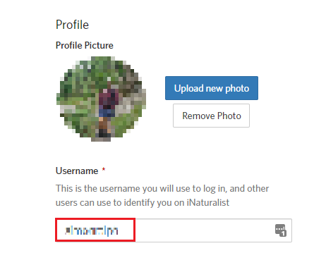

 1. Your iNaturalist username is the username that you use to log in to iNaturalist. First navigate to the iNaturalist website <a href='https://www.inaturalist.org/' target='_blank'> inaturalist.org</a>:
 
 
 
 2. If you log in via email you can find your iNaturalist username by logging in then going to account settings:
 
 
 
 3. Your username is then visible on this page:
 
  
 